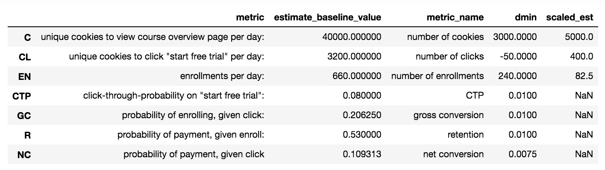

# A/B Testing - Deciding the Effectiveness of Adding Screener in User Flow on Decreasing Early Course Cancellation

## Experiment Overview

Experiment is conducted by Udacity, a website focusing on online courses. The business goal is to maximizing course completion by their users/students. 

**Control - Before Treatment/Change**
- At time of the experiment, Udacity courses have two options on the course overview page: 'start free trial', and 'access course materials' 
- When student clicks 'start free trial', they will be asked to enter credit card information, and they will be enrolled in a free trial for the paid version of the course. After 14 days, they will automatically be charged unless they cancel first.  
- If the student clicks "access course materials", they will be able to view the videos and take the quizzes for free, but they will not receive coaching support or a verified certificate, and they will not submit their final project for feedback.

**Experiment - Description of the Treatment/Change**
- The change was that if the student clicked "start free trial", they were asked how much time they had available to devote to the course. 
- If the student indicated 5 or more hours per week, they would be taken through the checkout process as usual. 
- If they indicated fewer than 5 hours per week, a message would appear indicating that Udacity courses usually require a greater time commitment for successful completion, and suggesting that the student might like to access the course materials for free. 
- Student have the option to continue enrolling in the free trial, or access the course materials for free instead. 
- [Screenshot](https://drive.google.com/file/d/0ByAfiG8HpNUMakVrS0s4cGN2TjQ/view?usp=sharing) of what the screener/experimnet looks like.

**Logic Behind the Change**
- The hypothesis was that the addition of the screener would set clearer expectations for students upfront, thus reducing the number of frustrated students who left the free trial because they didn't have enought time - without significantly reducing the number of students to continue past the free trial and eventually complete the course. 
- If the hypothesis is true, Udacity could improve the overall student experience and improve coaches' capactiy to support students who are likely to complete the course. 

## Experiment Design

**Unit of diversion (provided by Udacity)**

Unit of diversion is a cookie, but if the student enrolls in the free trial, they are tracked by user-id from that point forward. The same user-id cannot enroll in the free trial twice. For users that do not enroll, their user-id is not tracked in the experiment, even if they were signed in when they visited the course overview page.

**Metric Choice**

For an a/b testing experiment, we need to define two types of metrics: invariant and evaluation metrics. 

*Invariant metrics* are metrics that should not change cross the experiment & control groups. These metrics are used for "sanity checks" - that is, using the it to check if the experiment setup and results make sense.
In this experiment, we have choosen the following to be the invariant metrics:
- Number of cookies: The number of unique daily cookies to view the course overview page. This invariant metric is the unit of diversion, and is expected to similar for the control and experiment groups. 
- Number of clicks: The number of unique daily cookies to click the 'start free trial' button (which happens before the free trial screener). This is a good invariant metric because at this point in the user funnel, all users still have the same experience so the experiment should not have any impacts on this metric - meaning both groups should have similar values for this metric. 
- Click-through-probability: Number of unique daily cookies to click the 'start free trial' button divided by number of unique cookies to view the course overview page. Again, all user experiences are still the same for both groups at this point, thus, metric cannot be impacted by the treatment. 

*Evaluation metrics* are the metrics that are expected to change across the treatment and control groups. For each metric, there is a predetermined minimum difference (dmin) that serve as a practical significance to the business - basically, it is the minimum change that must be observed for consideration in launching the experiment. 
The following are the choosen evaluation metrics:
- Gross conversion: Number of user-ids to complete checkout and enroll in the free trial divided by number of unique cookies to click the 'start free trial' button. For this metric, we expect the treatment group to be lower than that of the control group. Through the treatment, we expect to redirect students who don't have enough time to study - thus not a good fit for the paid version, to the free version.  
- Retention: Number of user-ids to remain enrolled past the 14-day boundary (and thus make at least one payment) divided by number of user-ids to complete checkout. For this metric, we expect it to increase for the treatment group since we filtered out students who are likely to churn via the screener. 
- Net conversion: Number of user-ids to remain enrolled past the 14-day boundary (and thus make at least one payment) divided by the number of unique cookies to click the 'start free trial' button. For this metric, we hope to observe an increase for the treatment group, but this will all depend on the gross conversion and retention. 

The following tables serve as a summary of the choosen metrics. 

| Invariant Metric Name | Definition/Formula | dmin
| ------------- | ------------- | ------------- | 
| Number of Cookies (C)  | # of unique daily cookies to view course overview page  | 3000  |
| Number of Clicks (CL)  | # of unique daily cookies to click the 'start free trial' button |  240  |
| Click-Through-Probability (CTP)  | # of clicks/# of cookies  |  0.01  | 

| Evaluation Metric Name | Definition/Formula  | dmin  |
| ------------- |-------------| -----|
| Gross Conversion (GC) | # of user-ids enrolled/# of clicks | -0.01 |
| Retention (R)   | # of user-ids that paid/# of user-ids enrolled  |  0.01 |
| Net Conversion (NC) | # of user-ids paid/# of cookies   |   0.0075 |

In summary, in order to consider launching the feature, the following result need to be observed:
- Decrease in gross conversion with increased net conversion: meaning less students are enrolling in the free trial but more students are styaing after the free trial 
- Increase in retention: meaning more students staying beyond the free trial

## Measuring Variability

For this experiment, we were given estimates of the baseline values for the metris. We computed the variability for each evaluation metric. Higher the variability of a metric, the less pratical to use it as a metric in the experiment because it is harder to reach a significant result. 
Computed analytical estimate of metrics' standard deviation. Since the unit of diversion is equal to the unit of analysis, analytically computed variability is likely to be very close to empirically computed variability. Both Gross Conversion (GC) and Net Conversion (NC) fulfill the case described above. Retention (R) actually has a different unit of analysis, but we can start out by calcuating its variance analytically, if we end up using R as a metric, we can calculate the empricial variability. 

Moreover, the evaluation metrics are proportions so we made the assumption that the underlying distribution is binominal. Furthermore, since n is relatively large in this case, by the Central Limit Theorem, we assumed the sampling distribution of a sample proportion approaches a normal distriubtion. 

**Scaling**

We were given a sample size of 5,000 cookies visiting the course overview page per day. Since the given estimates of the baseline values have 40,000 cookies per day, we scaled the collected data first. The original and scaled data are shown below. 

**Calcuated Analytical Estimate of Standard Error**
| Evaluation Metric Name | SE  |
| ------------- |-------------|
| Gross Conversion (GC) | 0.0202 |
| Retention (R)   | 0.0549 |
| Net Conversion (NC) | 0.0156 |

## Experiment Sizing

**Number of Samples vs. Power**

Number of pageviews required for each evaluation metric were calculated using an alpha = 0.05 and beta = 0.2. We wanted to know the pageviews needed for each evaluation metric to achieve statistical power of 80%. 

*Gross Conversion* 

| sample size | number of groups | total sample size | clicks/pagview ratio | total pageviews needed |
| :-------------: | :-------------: | :-------------: | :-------------: | :-------------: |
| 25,699 cookies who click   'free trial' per group| 2 | 51,398 | 3,200/40,000 = 0.08 | 642,473 |

*Retention*

| sample size | number of groups | total sample size | enrollment/pageview ratio | total pageviews needed |
| :-------------: | :-------------: | :-------------: | :-------------: | :-------------: |
| 39,103 enrollments per group| 2 | 78,206 | 0.20625x0.08 = 0.0165 | 4,739,772 |

*Net Conversion*

| sample size | number of groups | total sample size | clicks/pagview ratio | total pageviews needed |
| :-------------: | :-------------: | :-------------: | :-------------: | :-------------: |
| 27,171 cookies who click   'free trial' per group| 2 | 54,342 | 0.08 | 679,282 |

To test and evaluate all three metrics, we would need a total of 4,739,772 pageviews. This seems unrealistically high. 
To test based on Gross Conversion, we need 642,473 pageviews, and to additionally test using metric Net Conversion, 679,282 pageviews are needed. Since the pageviews for Net Conversion is more than what was needed for Gross Conversion, we used the higher number and evaluated both metrics.  

**Duration vs. Exposure**

From our calculations, if we consider Retention, we would need a total of 4,739,772 pageviews for this experiment. Given the baseline value of daily pageview = 40,000, it would need around 119 days to complete this assuming we are using 100% of our traffic. This is pratically impossible because of the long duration and the risk of using all of the traffic, so we will not be using this metric. 
As mentioned before, it is risky to use 100% of our traffic for an experiment. Some of the risks include unhappy students who do not like the experiment userflow, lower conversion, and prevent the possibility of performing other experiments. Instead, we should use 50% of our traffic and divert it to two groups. 

Given 40,000 pageviews per day, 50% of this traffic should be used for the experiment and should need ~ 34 days to run the experiment. 
This is a bit longer than the ideal 1-3 weeks, since the nature of this experiment shouldn't be very high risk and if we also consider the needs of other possible experiments, we could incease the percentage of traffic diverted to 70% or even 80% >> reducing to 22 - 25 days. 

## Experiment Data Analysis

The experiment data is in two csv files, one for the control group, one for the experiment group. We loaded them as two separate dataframes. 

**Sanity Check**

First, we run a sanity check on the invariant metrics to verify that the experiment was conducted as expected. If the experiment had run properly and no influence from other factors, we would expect to see equal diversion into the experiment and control group. So for invariant metrics: 'number of cookies' and 'number of clicks on start-free-trial', we expect the amount of cookies (or clicks) in the control group to be 50% of the total cookies (or clicks) in both groups since they should be assigned randomly to either the control or experiment group. If we consider being assigned to control group as a 'success', we can use the binomial distribution to model the number of successes in the sample and perform one-proportion z-test for the sanity check. Since the number of samples (n) is large, we can further assume the sampling distribution approaches a normal distribution due to the Central Limit Theorem. 

For the invariant metric 'click-through-probability', we wanted to check if the probability is significantly different for the control and experiment group. For this, we can conduct a two proportion z-test with a click being interpreted as a success, and check the CTP for both groups. We assumed normal distribution.  
We tested at the 95% confidence interval. 

For all three metrics, we tried both approaches:
1. find the confidence interval and check if the observed value is within the CI
2. calculate the Z test statistic, find the p-value and compare to alpha = 0.05. If p-value > alpha, we cannot reject the null hypothesis, which means the observed *p* is equal to the expected *p* and the sanity check is passed. 
    - null hypothesis: expected value for the control group = expected value for the treatment group >> *p*EXPECTED = *p*OBSERVED
    - alternative hypothesis: expected value for the control group ≠ expected value for the treatment group >> *p*EXPECTED ≠ *p*OBSERVED

| Metric | Expected Value | Observed Value | Confidence Interval | p-value | Result |
| :-------------: | :-------------: | :-------------: | :-------------: | :-------------: | :-------------: |
| Number of Cookies| 0.5 | 0.5006 | 0.4988 to 0.5012 | 0.2878 | passed |
| Number of Clicks | 0.5 | 0.5005 | 0.4959 to 0.5041 | 0.8239 | passed |
| Click-Through-Probability | n/a | 0.0001 | -0.0013 to 0.0013 | 0.9317 | passed |

**Result Analysis**

Next, we analyzed the data in regards to the evaluation metrics. We want to check to see if the observered difference between the control and experiment group is statistically significant and pratically significant. We tested the evaluation metric hypotheses using two proportion z-test. Again, we tried both of the following approaches to test for statistical significance:
1. Computed the respective confidence interval around the observed difference between the conversion metrics, if the CI does not contain 0, it is statistically significant. (used 95% confidence)
2. Computed the p-value and compare to alpha = 0.05. If p-value < alpha, we can reject the null hypothesis, which indicates there is a statistical significance for the difference between the control and experiment group. The hypotheses for both evaluation metrics are:
    
        - H0: GCcontrol = GCtreatment      
        - Ha: GCcontrol ≠ GCtreatment
    
        - H0: NCcontrol = NCtreatment
        - Ha: NCcontrol ≠ NCtreatment

To test for pratical significance, if the confidence interval does not include the pratical significance boundary (dmin that was previously given), then the change is pratically significant. 

Here's what we got for each metric:

| Metric | dmin | Observed Difference | Confidence Interval | p-value | Result |
| :-------------: | :-------------: | :-------------: | :-------------: | :-------------: | :-------------: |
| Gross Conversion| 0.01 | -0.0206 | -0.0291 to -0.012 | 2.578e-06 | statistically and pratically significant |
| Net Conversion | 0.0075 | -0.0049 | -0.0116 to 0.0019 | 0.1558 | not statistically significant, not pratically significant |

**Sign Test**

In addition, we conducted sign tests to double check the results we got. Using the provided daily data, we computed the metric's value for each day and counted the number of days the metric for the experiment group is higher than the metric for the control group and assume this as the number of successes for the binomial variable. We then looked at the ratio of days of success vs. all available days. Using a two tailed test, we compared the p-value to the alpha value of 0.05. Again, when p-value is less than alpha, it would be considered as statistically significant. 

| Metric | p-value from sign test | Result (p-value < 0.05?) | 
| :-------------: | :-------------: | :-------------: | 
| Gross Conversion| 0.0026 | Yes, statistically significant | 
| Net Conversion | 0.6776 | No, not statistically significant | 

The obtained conclusion matches with what we got from previous analysis - change in gross conversion is significant, but change in net conversion is not. 

## Make a Recommendation

The initial hope of this experiment was to use the screener to filter the students who have the time commitment for the paid version of the course, which then can reduce early cancellation of the paid program. 

A statistically and practically significant decrease in Gross Conversion was observed, meaning the screener did help with filtering out the people who do not have time to invest in the course. However, we did not see a statistical and practical significance increase in the Net Conversion. This means that the decrease in enrollment of the paid version did not link with an increase in students staying for the 14 days free trial and paying to continue with the paid version. Therefore, the recommendation is to not launch and try out other experiments. 
